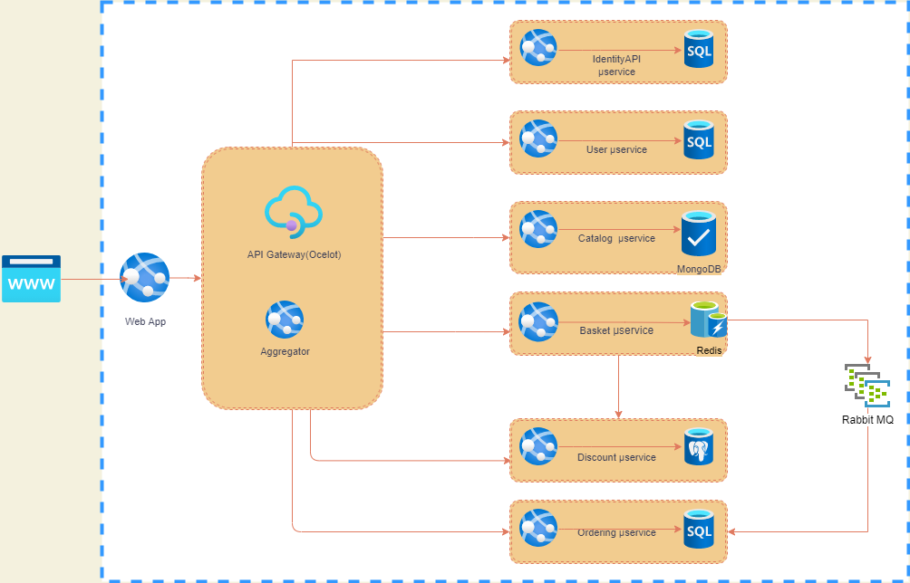

# eDukaan

## Introduction

This pet project was created to learn about eCommerce. However, it is still a work in progress and may require adjustments to function properly on MacOS. The issue will be resolved in upcoming updates.

### The project was inspired from

- [eShopOnContainers](https://github.com/dotnet-architecture/eShopOnContainers "eShopOnContainers")

### The free HTML template is from

- [eshopper-free-ecommerce](https://themehunt.com/item/1524993-eshopper-free-ecommerce-html-template)

## Architecture Overview

### Identity Service microservice which includes;

- ASP.NET Core Web API application.
- Provides Authentication using [Identity Server4](https://identityserver4.readthedocs.io/en/latest/)

### Catalog microservice which includes;

- ASP.NET Core Web API application

### Basket microservice which includes;

- ASP.NET Core Web API application

### Discount microservice which includes;

- ASP.NET **Grpc Server** application
- ASP.NET Core Web API application

### Microservices Communication

- Sync inter-service **gRPC Communication**

### Ordering Microservice

- ASP.NET Core Web API application

### User Microservice

- ASP.NET Core Web API application

### API Gateway

- API Gateways Implement **API Gateways with Ocelot**
- Aggregator ASP.NET Core Web API application

### Tools

- [Visual Studio 2022](https://visualstudio.microsoft.com/downloads/)
- [Visual Studio Code](https://code.visualstudio.com/Download/)
- [.Net Core 6 ](https://dotnet.microsoft.com/download/dotnet-core)
- [Docker Desktop](https://www.docker.com/products/docker-desktop)

## Docker Compose & all microservices on docker;

### Housekeeping

- Application data seed creates following two sample users (This should not go in PROD . Need to change in future):

  - U:JohnDoe@email.com, P:Pass@word1
  - U:JaneDoe@email.com, P:Pass@word1

- Add Following entries in Fiddler (Again windows specific stuff. Need to be dropped in future)
  - localhost:8000 identity.api
  - localhost:8001 catalog.api
  - localhost:8002 basket.api
  - localhost:8003 discount.api
  - localhost:8004 discount.grpc
  - localhost:8005 order.api
  - localhost:8006 user.api
  - localhost:8010 ocelotapigw
  - localhost:8008 shopping.aggregator
  - localhost:8100 razor.ui

### Running

- As of now only running on Windows setup
- Inside src folder run following command

  - docker-compose -f ./docker-compose.yml -f ./docker-compose.override.yml up --build

- To check all your running images navigate to http://portainer/
- On your local browser navigate to http://razor.ui/

### Observability (Immediate Concerns)

- Uniform Logging approach needs to be adopted
- Needs to think about observability approach
